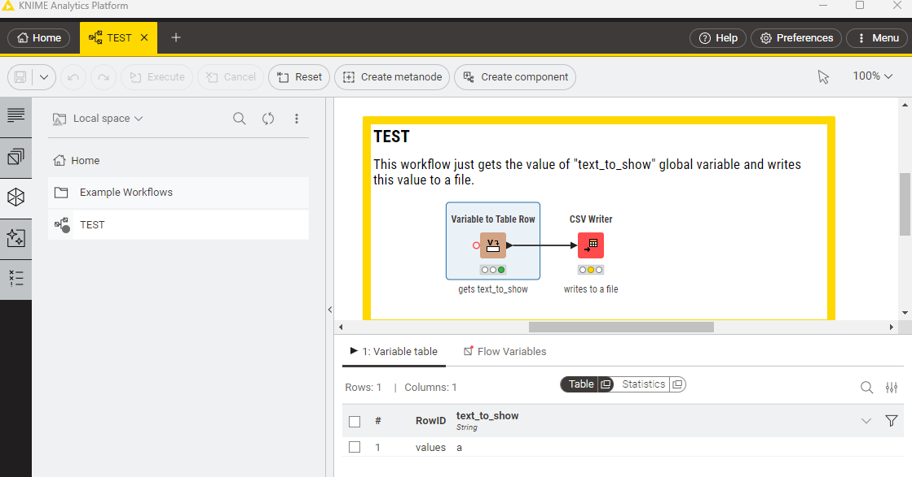
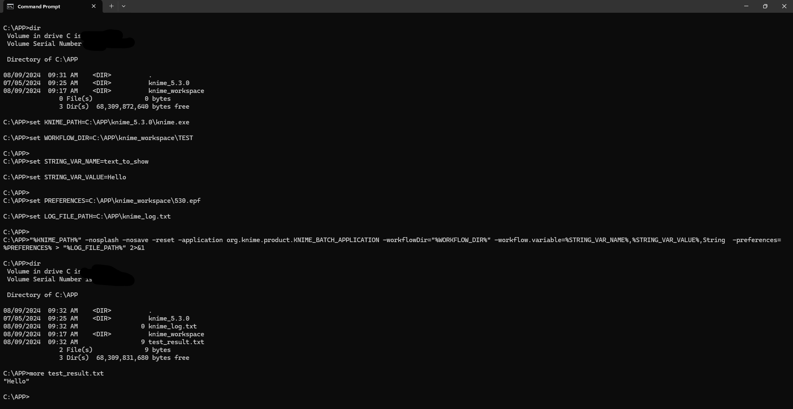
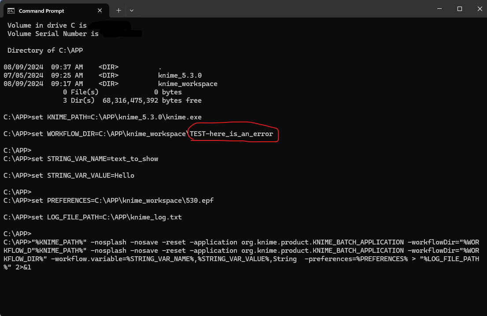
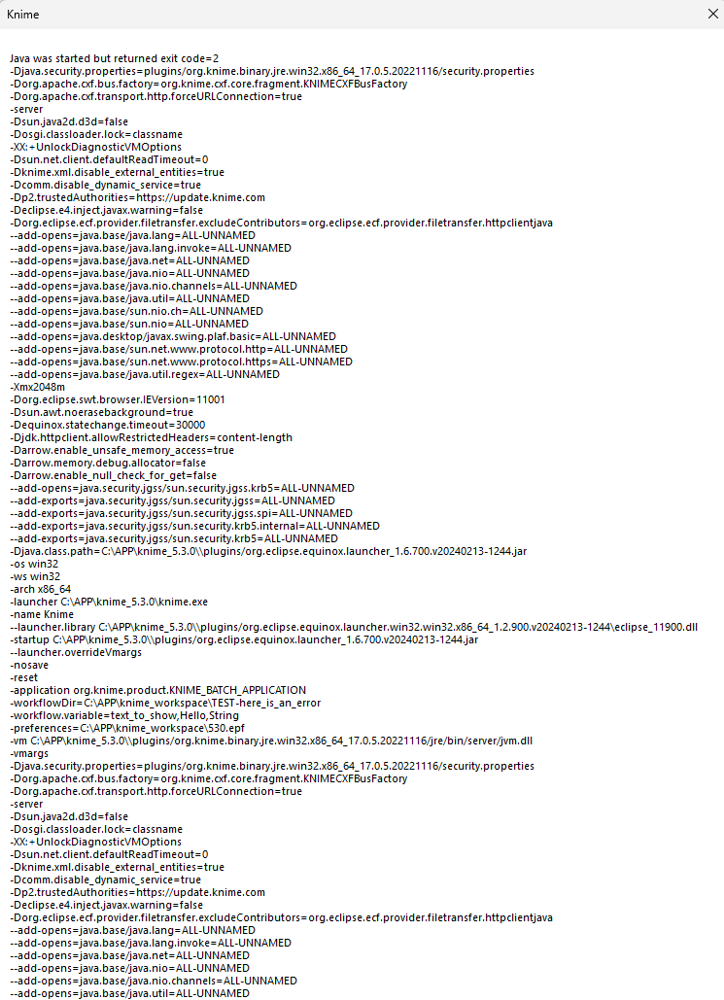
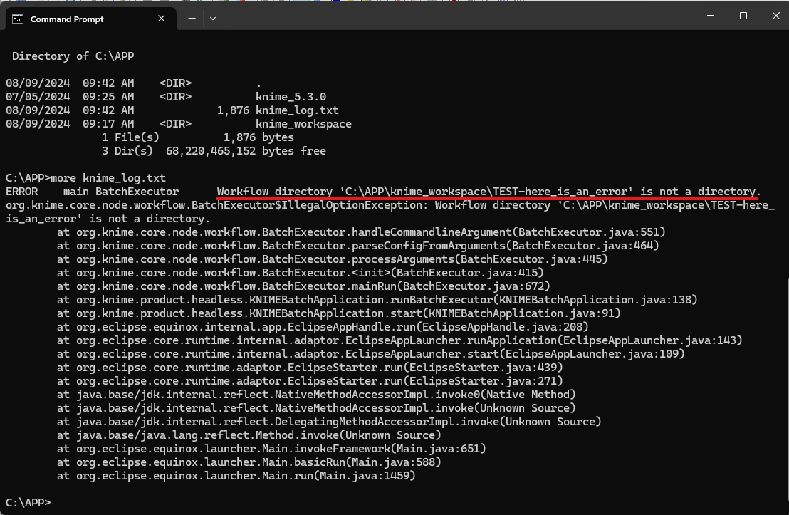
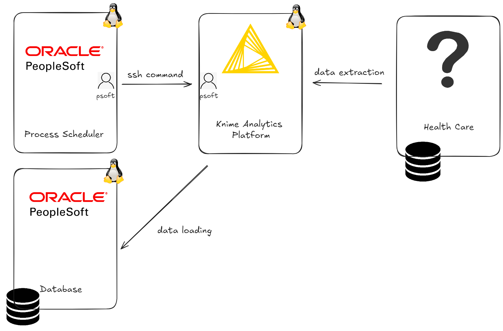
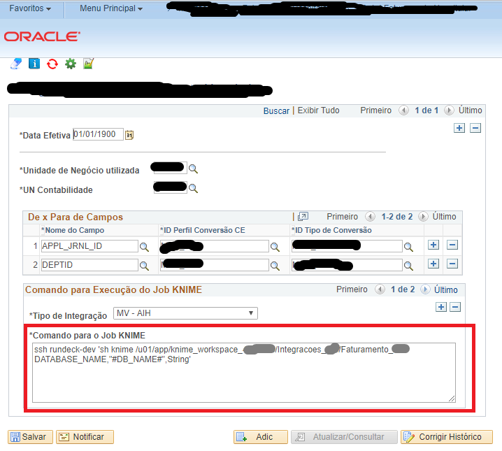

# Headless execution of Knime Analytics Platform

The idea here is to show how to implement a headless execution of Knime Analytics Platform, both in Linux and Windows OS.

## What is a headless execution of Knime Analytics Platform ?

A headless execution of Knime is the name given to a Knime execution by command line:
- no graphic interface is opened
  - in standard pressure and temperature conditions, that is, without the occurrence of errors, no graphic interface of Knime is opened. If an error occurs, an screen is opened and you can read the Matrix (see mode detais [here](#reading-the-matrix)).
- there is no a complete control of error messages, but you can generate logs of these errors
- it doesn't work fine when workflow or arguments paths have spaces
- security (user accounts and groups) is managed by OS
- not recommended by Knime company
  - but, in my experience, it work fine even in production environment ! See an example of implementation [here](#an-implementation-example-in-production)

You can read a complete and excellent article of headless execution of Knime, wrote by Marcus Lauber in this [link](https://medium.com/low-code-for-advanced-data-science/knime-batch-processing-on-windows-and-macos-caacde067bd0).

## Headless execution of Knime in Linux

Supposing your Knime Analytics Platform is installed on `/APP/knime`, you could use the following command line to run Knime:

```shell
./knime -consoleLog -reset -nosave -nosplash -application org.knime.product.KNIME_BATCH_APPLICATION -workflowDir=[place here the absolute path to you workflow's folder] -workflow.variable=[name],"[value]",[type]
```
## Headless execution of Knime in Windows

On Windows, supposing your Knime Analytics Platform is installed on `C:\APP\knime_5.3.0` and you want to run the workflow TEST, which fills the variable `text_to_show` with the value "Hello", you could run the following code:

```
set KNIME_PATH=C:\APP\knime_5.3.0\knime.exe
set WORKFLOW_DIR=C:\APP\knime_workspace\TEST-here_is_an_error

set STRING_VAR_NAME=text_to_show
set STRING_VAR_VALUE=Hello

set PREFERENCES=C:\APP\knime_workspace\530.epf
set LOG_FILE_PATH=C:\APP\knime_log.txt

"%KNIME_PATH%" -nosplash -nosave -reset -application org.knime.product.KNIME_BATCH_APPLICATION -workflowDir="%WORKFLOW_DIR%" -workflow.variable=%STRING_VAR_NAME%,%STRING_VAR_VALUE%,String  -preferences=%PREFERENCES% > "%LOG_FILE_PATH%" 2>&1
```

The `preferences` parameter is unnecessary if you do not want to change any current parameter of Knime. The log of this execution is stored on the file `C:\APP\knime_log.txt`.

Let's see this execution working.

### Workflow definition

The TEST workflow is quite simple: it just gets the value of a global variable and writes it to a file.

<picture>
 <source media="(prefers-color-scheme: dark)" srcset="images/image1.png">
 <source media="(prefers-color-scheme: light)" srcset="images/image1.png">
 
</picture>

So, let's run the Knime on headless mode and check the result:

<picture>
 <source media="(prefers-color-scheme: dark)" srcset="images/image2.png">
 <source media="(prefers-color-scheme: light)" srcset="images/image2.png">
 
</picture>

You can also create a `.bat` file and store into it all instructions.

Ok. Now, let's insert an error on instructions and see what happens next.

<picture>
 <source media="(prefers-color-scheme: dark)" srcset="images/image3.png">
 <source media="(prefers-color-scheme: light)" srcset="images/image3.png">
 
</picture>

Immediately an error screen is opened:

<picture>
 <source media="(prefers-color-scheme: dark)" srcset="images/image4.png">
 <source media="(prefers-color-scheme: light)" srcset="images/image4.png">
 
</picture>

## Reading the Matrix

So, what does this error screen show of important to understand what happened ?

The first line indicates what kind of problem you are facing: `Java was started but returned exit code=2`. According to this [old documentation](https://web.archive.org/web/20190705041125/http://docs.hpc.shef.ac.uk/en/latest/iceberg/software/apps/knime.html), cited by [Markus Lauber](https://forum.knime.com/t/execute-workflow-in-batch-mode-windows-10/13986/22), these are the possible exit codes:

```
0 upon successful execution
2 if parameters are wrong or missing
3 when an error occurs during loading a workflow
4 if an error during execution occurred
```

Now its time to check the workflow execution's log:

<picture>
 <source media="(prefers-color-scheme: dark)" srcset="images/image5.png">
 <source media="(prefers-color-scheme: light)" srcset="images/image5.png">
 
</picture>

And, yes, it is clear what is the problem: there is no a directory (workflow, when thinking about Knime) `C:\APP\knime_workspace\TEST-here_is_an_error``.

## An implementation example in production

The following use case illustrates an application of headless execution of Knime.

- there are accounting entries at Health Care system which need to be loaded to Oracle Peoplesoft Financials
- it is necessary to perform some layout transformations
- user knows how to run processes inside Peoplesoft, so the solution was to create a process that:
  - receives parameters from user
  - calls a Knime process in headless mode that populates an interface table
  - loads data from the interface table

This is the big picture of the process:

<picture>
 <source media="(prefers-color-scheme: dark)" srcset="images/image6.png">
 <source media="(prefers-color-scheme: light)" srcset="images/image6.png">
 
</picture>

Here is an picture of the process definition inside Peoplesoft (some data were hidden). Peoplesoft process performs an ssh command which calls `knime` script sending two parameters to it:

<picture>
 <source media="(prefers-color-scheme: dark)" srcset="images/image7.png">
 <source media="(prefers-color-scheme: light)" srcset="images/image7.png">
 
</picture>

The `knime` script hides the complexity of headless execution of Knime:

```shell
[psoft@rundeck ~]$ cat knime
/u01/app/knime_4.4.0/knime -nosplash -nosave -reset -application org.knime.product.KNIME_BATCH_APPLICATION -workflowDir=$1 -workflow.variable=$2 -preferences=/u01/app/knime_4.4.0/preferences440.epf
```

## Final remarks

Knime Analytics Platform is a very nice low-code/no-code tool. It gives power to Analysts to perform their data transformations. Headless mode of execution is the half-way to schedule these workflows.

## Helpful links and references

- https://forum.knime.com/t/execute-workflow-in-batch-mode-windows-10/13986/24
- https://medium.com/low-code-for-advanced-data-science/knime-batch-processing-on-windows-and-macos-caacde067bd0
- https://web.archive.org/web/20231208203103/https://www.knime.com/faq#q12